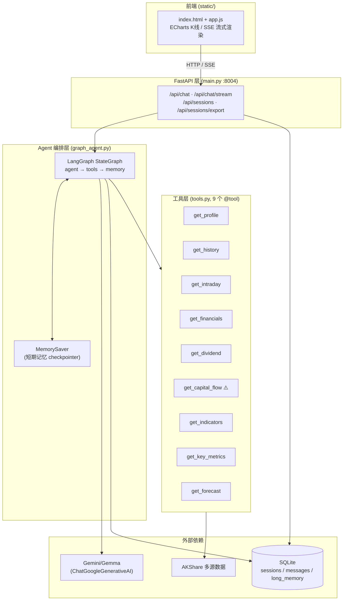
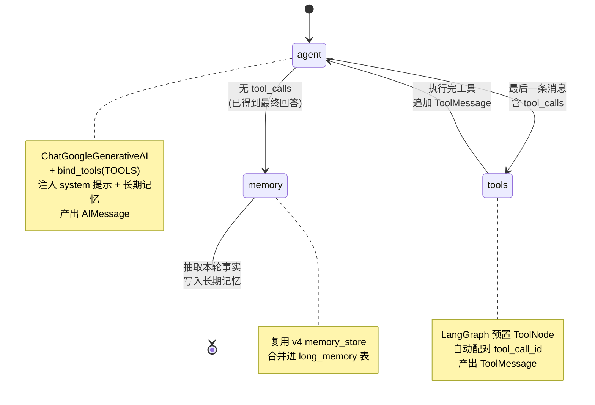
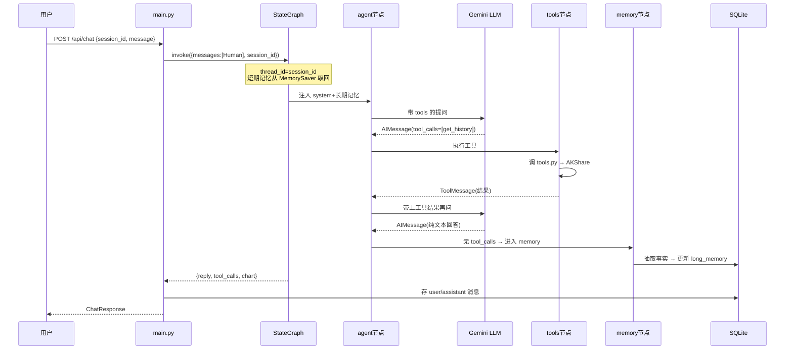
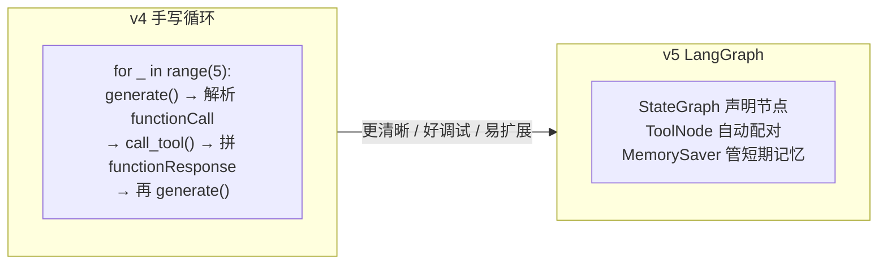

# v5 — LangGraph 编排的股票信息助手

这是 `2026-07-11-Stock-Collector` 项目的第 5 个版本。它在 v4（手写工具调用循环）的基础上，把 Agent 的编排换成 [LangGraph](https://github.com/langchain-ai/langgraph) 的 `StateGraph`，图结构更清晰、好调试、易扩展。

> 练手项目，边学边做，欢迎拍砖 🙏

---

## 1. 整体架构（分层）



---

## 2. LangGraph 状态图（核心）

这是 v5 与 v4 最大的区别——v4 是手写 `for` 循环，v5 是**声明式图**：



条件边 `_should_continue` 的逻辑（在 `graph_agent.py` 中）：

```python
def _should_continue(state):
    last = state["messages"][-1]
    if getattr(last, "tool_calls", None):
        return "tools"      # 还要继续调工具
    return "memory"         # 收尾：写长期记忆
```

---

## 3. 一次对话的生命周期



---

## 4. 文件职责对照

| 文件 | v5 职责 | 与 v4 关系 |
|------|---------|-----------|
| `graph_agent.py` | **新增**：LangGraph 图编排（agent/tools/memory 三节点） | v4 的 `agent_runner.py` 被取代 |
| `main.py` | FastAPI 入口，端口 8004，调用 `graph_app.invoke(...)` | 结构同 v4，仅换调用入口 |
| `tools.py` | 9 个工具函数（被 `@tool` 包装） | 完全复用 v4 |
| `llm_client.py` | Gemini REST 接入（降级用） | 完全复用 v4 |
| `memory_store.py` | 长期记忆持久化 | 完全复用 v4 |
| `session_store.py` | 会话/消息存储 | 完全复用 v4 |
| `static/` | 前端页面 | 完全复用 v4 |

---

## 5. v4 → v5 关键变化



要点：
- **短期记忆**：v4 手动从 `messages` 表读最近 12 轮拼 `contents`；v5 交给 `MemorySaver` checkpointer（`thread_id = session_id`），图自动维护。
- **工具调用闭环**：v4 自己解析 `functionCall` / 拼 `functionResponse`；v5 用 `ToolNode` 自动处理 `tool_call_id ↔ ToolMessage` 配对。
- **长期记忆**：两者都复用 `memory_store`，但 v5 把它做成图的 `memory` 节点，在对话自然结束时触发。
- **降级路径**：无 `GEMINI_API_KEY` 时，v5 仍走 v4 同款关键词降级（`_fallback_run`），且依赖缺失也能正常导入模块。

---

## 6. 快速开始

```bash
cd 2026-07-12-v5
source ../2026-07-12-v1/.venv/bin/activate   # 复用 v1 的虚拟环境
pip install -r requirements.txt
export GEMINI_API_KEY="你的Key"               # 可选，留空则降级关键词驱动
uvicorn main:app --port 8004
```

浏览器打开 http://127.0.0.1:8004

> 小提示：不填 `GEMINI_API_KEY` 也能跑，只是会退化成「关键词驱动」的简化模式，用来体验流程完全够用。

---

## 已知限制

- 我这台机器网络下，东方财富 push2 行情接口被代理拦了，`get_capital_flow`（个股资金流向）暂时用不了；按需求把 API 调用位置先留空，并给了替代方案（北向/板块资金流）。
- LLM 工具调用闭环需要配置 `GEMINI_API_KEY`；没配的话走关键词降级路径（已验证可用）。

## 许可证

MIT（如需商用请自行确认数据源合规）。
