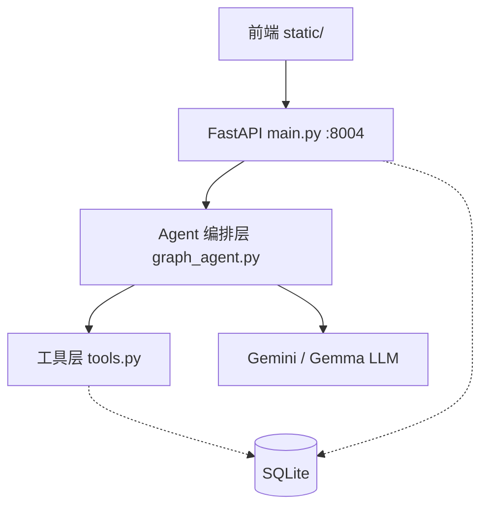
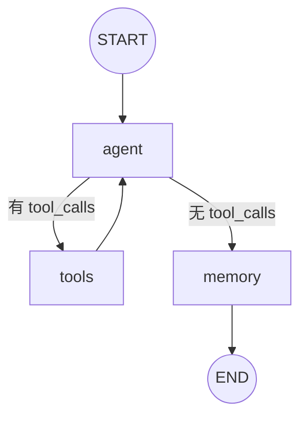

# 🚀 Stock-Info-Agent v6

### 生产级 A 股 AI 助手 — LangGraph 编排 · 多轮对话 · 9 大股票工具


---

## 📑 目录

- [项目简介](#-项目简介)
- [特性亮点](#-特性亮点)
- [架构设计](#-架构设计)
- [快速开始](#-快速开始)
- [工具能力表](#-工具能力表)
- [环境变量](#-环境变量)
- [v6 改进清单](#-v6-改进清单)
- [项目结构](#-项目结构)
- [技术栈](#-技术栈)
- [License / 免责声明](#-license--免责声明)

---

## 📖 项目简介

Stock-Info-Agent v6 是 `2026-07-11-Stock-Collector` 系列的**生产级优化版本**。它在 v5（首次引入 LangGraph 声明式编排）的基础上，针对工程健壮性、性能与可维护性做了全面加固——消除冗余调用、补齐超时与容错、引入 SQLite WAL 模式与持久化 Checkpointer，让系统真正具备生产可用的稳定性。

项目核心能力：用户通过浏览器与 AI 助手多轮对话，系统调用 AKShare 数据工具获取 A 股实时行情、公司资料、财务数据、资金流向等，并以文字 + ECharts 图表的形式返回分析结果。底层由 Gemini/Gemma 大模型驱动，无 Key 时自动降级为关键词模式。

---

## ✨ 特性亮点

| 特性 | 说明 |
|------|------|
| 💬 多轮对话 | 基于 LangGraph StateGraph 管理上下文，短期记忆由 MemorySaver/SqliteSaver 自动维护 |
| 🧠 长期记忆 | memory 节点在对话结束时抽取关键事实，持久化写入 SQLite `long_memory` 表 |
| 🔧 9 大股票工具 | 覆盖公司资料、历史 K 线、分时行情、财务报表、分红、资金流向、技术指标、关键指标、盈利预测 |
| 📊 图表可视化 | 前端 ECharts 渲染 K 线图、分时图，SSE 流式推送实时更新 |
| 🔄 无 LLM 降级 | 未配置 `GEMINI_API_KEY` 时自动切换关键词驱动模式，核心功能仍可用 |
| ⚡ Token 优化 | 工具消息截断 + `get_history` 限行 200 条 + TTL 缓存，减少无效 Token 消耗 |
| 💾 持久化会话 | SQLite 单例 + WAL 模式，SqliteSaver Checkpointer 保证断线恢复 |
| 🛡️ 容错与超时 | 全局 30s 超时保护、SSE 流容错、ChatRequest 参数校验 |

---

## 🏗️ 架构设计

### 整体分层



### LangGraph StateGraph 核心编排



- **agent 节点**：`ChatGoogleGenerativeAI` + `bind_tools`，注入 system 提示 + 长期记忆，产出 `AIMessage`
- **tools 节点**：LangGraph 预置 `ToolNode`，自动配对 `tool_call_id ↔ ToolMessage`
- **memory 节点**：抽取本轮对话事实，写入 `long_memory` 表
- **条件边 `_should_continue`**：根据最后一条消息是否含 `tool_calls` 决定继续调工具还是进入记忆收尾

---

## 🚀 快速开始

**1. 安装依赖**

```bash
cd 2026-07-12-v6
pip install -r requirements.txt
```

**2. 配置环境变量**

```bash
cp .env.example .env
# 编辑 .env，填入你的 Gemini API Key
# GEMINI_API_KEY="your-api-key-here"
# GEMINI_MODEL="gemma-4-31b-it"   # 可选，默认 gemma-4-31b-it
```

> 不填 `GEMINI_API_KEY` 也能运行——系统将退化为关键词驱动模式，适合体验流程。

**3. 启动服务**

```bash
uvicorn main:app --port 8004
```

**4. 访问前端**

浏览器打开 [http://127.0.0.1:8004](http://127.0.0.1:8004)

---

## 🔧 工具能力表

| 工具 | 用途 | 典型示例 |
|------|------|----------|
| `get_profile` | 公司资料（上市板块、行业、主营业务） | "贵州茅台的主营业务是什么？" |
| `get_history` | 历史日 K 线行情（开/收/高/低/量） | "比亚迪最近三个月的股价走势" |
| `get_intraday` | 当日分时行情 | "中国平安今天的分时走势" |
| `get_financials` | 财务报表数据 | "宁德时代最新财报" |
| `get_dividend` | 分红派息记录 | "工商银行历年分红" |
| `get_capital_flow` | 个股资金流向 | "隆基绿能今日资金流入情况" |
| `get_indicators` | 技术指标（MA/MACD/KDJ 等） | "招商银行的 MACD 指标" |
| `get_key_metrics` | 关键财务指标（PE/PB/ROE 等） | "腾讯的市盈率是多少" |
| `get_forecast` | 盈利预测与分析师共识 | "中芯国际明年的盈利预测" |

---

## ⚙️ 环境变量

| 变量名 | 必填 | 默认值 | 说明 |
|--------|------|--------|------|
| `GEMINI_API_KEY` | 否 | — | Gemini API Key，留空则走关键词降级路径 |
| `GEMINI_MODEL` | 否 | `gemma-4-31b-it` | 覆盖默认 LLM 模型 |
| `V4_DB_PATH` | 否 | `v6_sessions.db` | SQLite 数据库文件路径 |

---

## ✅ v6 改进清单

- [x] **消除双重记忆调用**：合并冗余的长期记忆读取，每轮只查一次
- [x] **工具消息截断**：超长工具返回自动裁剪，避免 Token 爆炸
- [x] **`get_history` 限行 200 + TTL 缓存**：限制返回行数并加本地缓存，降低重复请求开销
- [x] **30s 全局超时**：LLM 调用与工具执行均受超时保护，防止请求挂死
- [x] **SQLite 单例 + WAL 模式**：Write-Ahead Logging 提升并发读写性能
- [x] **`asyncio.to_thread` 解阻塞**：同步 DB 操作异步化，不阻塞事件循环
- [x] **`ChatRequest` 参数校验**：Pydantic 模型严格校验入参，防御非法请求
- [x] **SSE 流容错**：流式推送异常时优雅降级，不中断前端连接
- [x] **可观测性中间件**：请求日志 + 耗时统计，便于排查与性能分析
- [x] **`SqliteSaver` 持久化 Checkpointer**：替代纯内存 `MemorySaver`，支持会话断线恢复

---

## 📁 项目结构

```
2026-07-12-v6/
├── .env.example        # 环境变量模板
├── .gitignore          # Git 忽略规则
├── README.md           # 项目说明
├── graph_agent.py      # LangGraph StateGraph 编排（agent/tools/memory 三节点）
├── llm_client.py       # Gemini REST 接入层（降级用）
├── main.py             # FastAPI 入口，路由 + 中间件 + SSE
├── memory_store.py     # 长期记忆持久化（SQLite long_memory 表）
├── requirements.txt    # Python 依赖
├── session_store.py    # 会话与消息存储（SQLite sessions/messages 表）
├── tools.py            # 9 个 AKShare 数据工具（@tool 装饰器）
└── static/             # 前端静态资源
    ├── index.html      # 主页面
    ├── app.js          # 前端逻辑（SSE 流式渲染 + ECharts）
    └── style.css       # 样式
```

---

## 🛠️ 技术栈

| 技术 | 作用 |
|------|------|
| **LangGraph** | 声明式 StateGraph 编排，管理 agent → tools → memory 三节点流转 |
| **LangChain** | 消息抽象（HumanMessage/AIMessage/ToolMessage）、工具绑定、LLM 接口 |
| **AKShare** | A 股多源金融数据接口，提供行情、财务、资金等底层数据 |
| **FastAPI** | 异步 Web 框架，提供 REST API 与 SSE 流式推送 |
| **SQLite + WAL** | 轻量持久化存储，WAL 模式提升并发性能 |
| **ECharts** | 前端图表库，渲染 K 线图、分时图等可视化 |
| **Gemini / Gemma** | Google 大语言模型，驱动自然语言理解与工具调用 |

---

## 📄 License / 免责声明

本项目基于 **MIT License** 开源。

> ⚠️ **免责声明**：本项目仅供学习与研究用途，不构成任何投资建议。股市有风险，投资需谨慎。数据来源于 AKShare 公开接口，准确性以官方数据为准。
